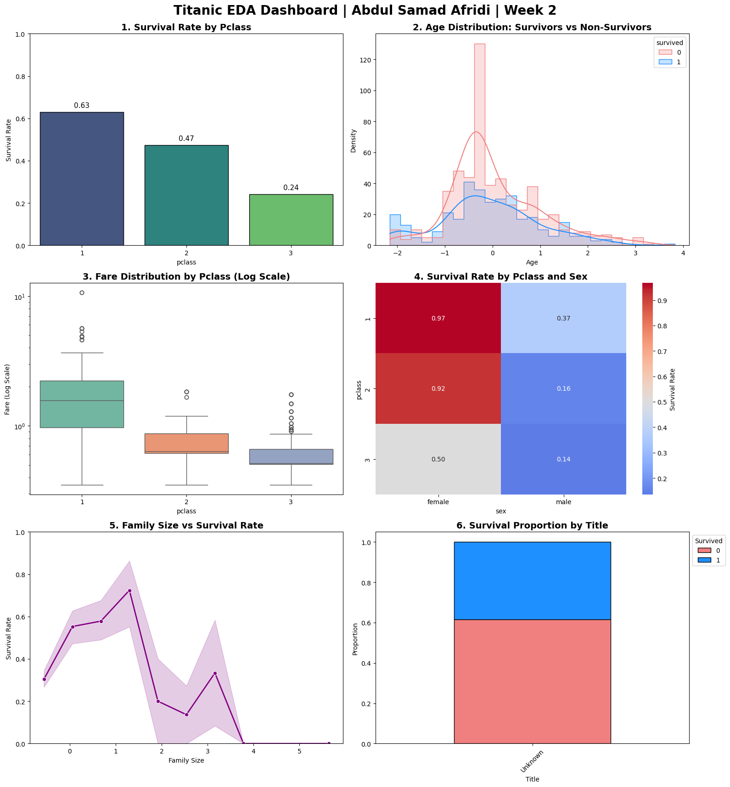

# Titanic Passenger Survival Analysis

**Author:** Abdul Samad Afridi

## 📊 Dataset Information
This project analyzes the historical Titanic passenger dataset, which contains demographic and travel information for 891 passengers. The primary goal of this analysis is to clean the raw data, engineer new predictive features, and identify the key factors that influenced passenger survival during the 1912 maritime disaster, preparing the data for Machine Learning classification.

## 💡 Top 3 Survival Insights
1. **Gender was the Ultimate Filter:** The "women and children first" maritime protocol was strictly enforced. Females survived at a rate of ~74.2%, while males survived at only ~18.9%, making gender the single strongest predictor of survival.
2. **Class Determined Access:** Socioeconomic status played a fatal role. 1st-class passengers had a ~63% survival rate, compared to a devastating ~24% in 3rd class, driven by ship geography and proximity to lifeboats.
3. **Family Dynamics Mattered:** Traveling solo or in massive families (5+ members) severely reduced survival odds. Small family units (2-4 members) experienced the highest survival rates, likely due to a balance of mutual support without the logistical burden of coordinating a massive group.

## 📸 Visual Dashboard

*(Note: Ensure `titanic_dashboard.png` is uploaded to the same folder as this README)*

## 🛠️ Tools & Technologies Used
* **Python 3:** Core programming language.
* **Pandas:** Data manipulation, cleaning, and feature engineering.
* **NumPy:** High-performance numerical computations and matrix operations.
* **Seaborn & Matplotlib:** Advanced data visualization and dashboard creation.
* **Scikit-Learn:** Data preprocessing and scaling (`StandardScaler`).
